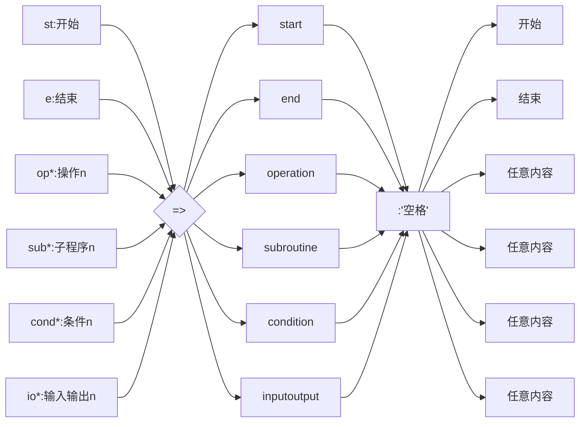

# 流程图

##语法规则

###定义元素

1. 定义元素的格式为`tag=>type: text`，实例:`st=>start: 开始`。

2. type有6种类型，分别为：

   * start（开始）
   * end（结束）
   * operation（操作）
   * subroutine（子程序）
   * condition（判断/条件）
   * inputoutput（IO/输入输出）

3. tag可以为任意内容，但一般命名与type对应，取首字母+数字的形式，如`op1`。

4. text为定义的元素在流程图中显示出来的内容。

   根据类型的数量，我们一般定义6种元素即可绘制出流程图，6种元素的定义格式一般如下图所示：



###连接元素

1. 连接元素的语法格式为`tag1->tag2->tag3`；
2. 当指向判断元素时`tag->cond`，由于`condition`类型有`yes`和`no`两个分支，需要换行分别写`cond(yes)->tag`和`cond(no)->tag`。
3. 每个元素默认是向下连接的，也可以对元素的走向进行设置，`tag(right)`可使元素指向右边。


##实例

```
给定一门课的百分制成绩n，将其换算为绩点成绩m。
成绩分数小于60则绩点为0，其它分数换算规则如下：
```

|   grade   |  100>n>=90   |   90>n>=85   |   85>n>=80   |   80>n>=76   | 76>n>=73 |
| :-------: | :----------: | :----------: | :----------: | :----------: | :------: |
|   point   |     4.0      |     3.7      |     3.3      |     3.0      |   2.7    |
| **grade** | **73>n>=70** | **70>n>=66** | **66>n>=63** | **62>n>=61** | **n=60** |
|   point   |     2.3      |      2       |     1.7      |     1.3      |   1.0    |

​	定义元素如下：

```
st=>start: 开始
e=>end: 结束
in=>inputoutput: 输入成绩n
cond1=>condition: >=90？
cond2=>condition: >=85？
cond3=>condition: >=80？
cond4=>condition: >=76？
cond5=>condition: >=73？
cond6=>condition: >=70？
cond7=>condition: >=66？
cond8=>condition: >=63？
cond9=>condition: >=61？
cond10=>condition: >=60？
op=>operation: 换算绩点
out=>inputoutput: 输出绩点m
```


连接元素如下：

```
st->in->cond1
cond1(yes,right)->op
cond1(no)->cond2
cond2(yes,right)->op
cond2(no)->cond3
cond3(yes,right)->op
cond3(no)->cond4
cond4(yes,right)->op
cond4(no)->cond5
cond5(yes,right)->op
cond5(no)->cond6
cond6(yes,right)->op
cond6(no)->cond7
cond7(yes,right)->op
cond7(no)->cond8
cond8(yes,right)->op
cond8(no)->cond9
cond9(yes,right)->op
cond9(no)->cond10
cond10(yes,right)->op
cond10(no)->op
op->out->e
```

绘制的流程图为：

```flow
st=>start: 开始
e=>end: 结束
in=>inputoutput: 输入成绩n
cond1=>condition: >=90？
cond2=>condition: >=85？
cond3=>condition: >=80？
cond4=>condition: >=76？
cond5=>condition: >=73？
cond6=>condition: >=70？
cond7=>condition: >=66？
cond8=>condition: >=63？
cond9=>condition: >=61？
cond10=>condition: >=60？
op=>operation: 换算绩点
out=>inputoutput: 输出绩点m

st->in->cond1
cond1(yes,right)->op
cond1(no)->cond2
cond2(yes,right)->op
cond2(no)->cond3
cond3(yes,right)->op
cond3(no)->cond4
cond4(yes,right)->op
cond4(no)->cond5
cond5(yes,right)->op
cond5(no)->cond6
cond6(yes,right)->op
cond6(no)->cond7
cond7(yes,right)->op
cond7(no)->cond8
cond8(yes,right)->op
cond8(no)->cond9
cond9(yes,right)->op
cond9(no)->cond10
cond10(yes,right)->op
cond10(no)->op
op->out->e
```

##总结

​	虽然我们能够很快地绘制出一副流程图，但是它呈现的最终效果（似乎）是不可控的。对于简单的图例，它能够很快也很美观地生成；但包含元素较多的时候，它自动生成的图表尺寸就会有些奇怪（过长或过宽）。

​	同时，它的图例由代码渲染，不便于修改元素的布局。如果生成的流程图你不满意，想要修改图标的位置就会有些棘手。

​	由于Markdown原生是不支持流程图的，它实现流程图的绘制是依赖编辑器支持，依赖[flowchart.js](http://flowchart.js.org/)而实现的。相比于Office Visio、[ProcessOn](https://www.processon.com/)等以组件形式绘图的软件，这些软件可选的图标样式更多，颜色更丰富，修改布局也更容易。因此，我将Markdown作为一个轻量级的替代品，当你的工作量并不大的时候，就选择它吧！